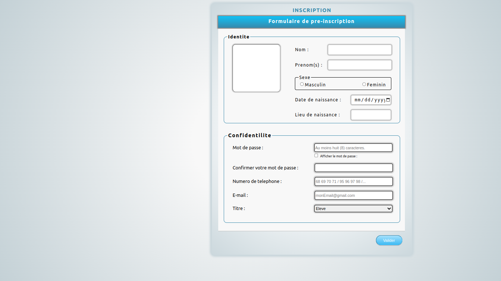

# School Manager Web Pages


This project is an academy project. This's made to evaluate my level in native web development languages; test my capacity to make some user interfaces with HTML, CSS and JavaScript only and learn more things about theses technologies. It's front-end project only. No any back-end API is called. All fields checking on pages are made on the client with JavaScript. The main goal of this project is to make user interfaces in case of schools to increase my level in HTML, CSS and JavaScript as well as DOM manipulation.

## Final result
This is the final result of the project:<br/><br/>





## Project installation
```sh
git clone git@github.com:obrymec/School-Manager.git school-manager/
```

Enjoy :)
