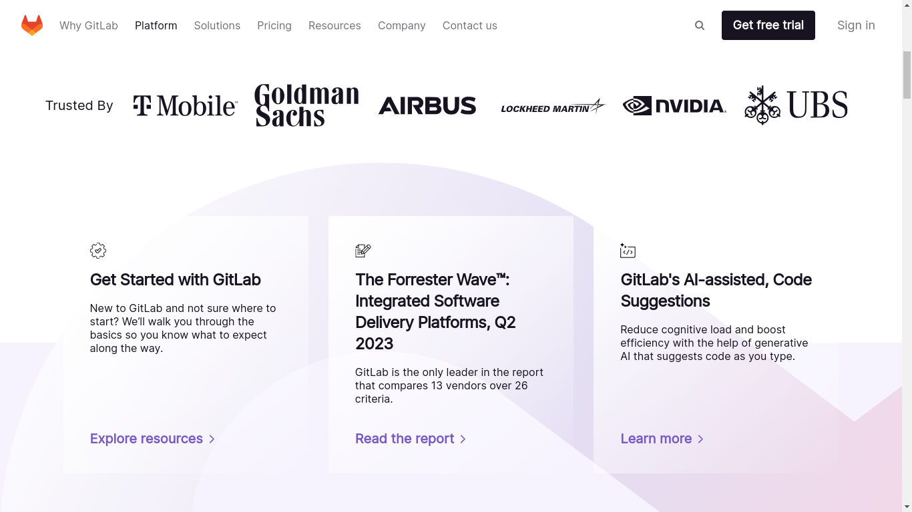
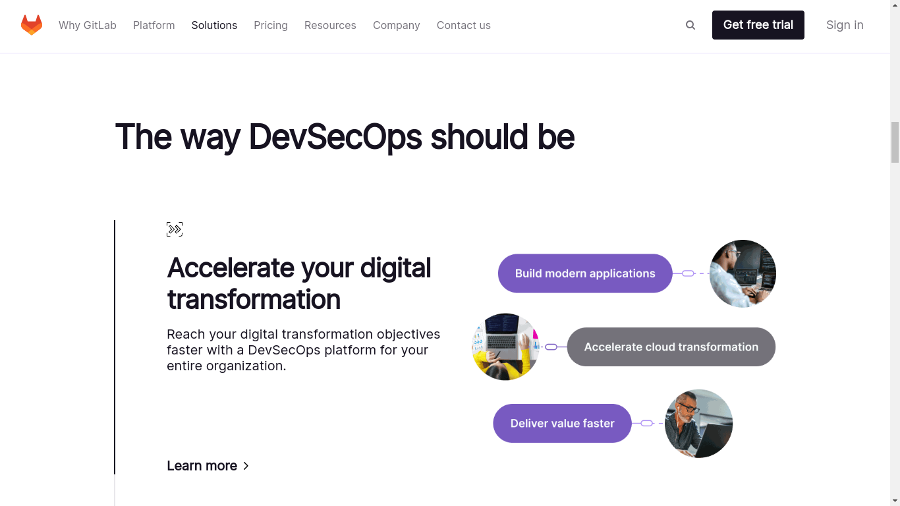
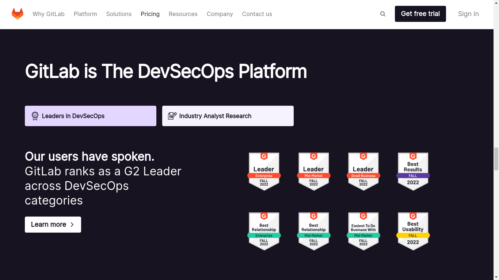
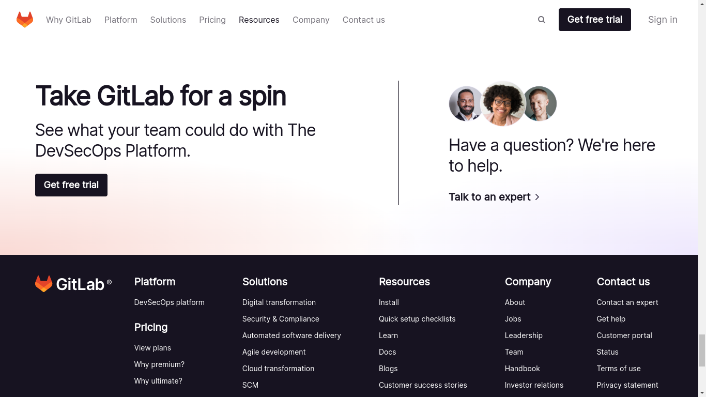

# GitLab Home Page Clone


The project is academic. It's made to evaluate my level in
native web development languages; test my capacity to build
advanced user interfaces with HTML, CSS and JavaScript only
and learn more things about those technologies. It's a
front-end project only. No any back-end API is called.
The main goal of this project is to reproduce the old
GitLab home page only.

## Access links
The project is already hosted on web and can be
accessible through one of these links below :<br/>
- https://obrymec.github.io/gitlab_home_page_clone/
- https://obrymec.gitlab.io/gitlab_home_page_clone/
- https://gitlab-home-page-clone.onrender.com

## Reference
The project can be found via the link below :<br/>
- https://gitlab.com/obrymec/gitlab_home_page_clone

## Final result
This is the final result of the project:<br/><br/>
### Video
[](https://youtu.be/j7LeZvGRDzQ)

### Screenshots





## Project installation
⚠️ This project uses some nodejs packages for code
minification, css purge and auto prefixer for his
production phase.
If you want to use <i><a href = "https://code.visualstudio.com/download">
vscode</a></i> to open the project sources,
you can skip all steps before clone the project
sources code and also dependencies installation
whether you want. Otherwise, <b><i>it's
mandatory to follow the steps below</i></b>.

### <u>Install nodejs</u>
```sh
cd ~;\
sudo apt install curl;\
curl https://raw.githubusercontent.com/creationix/nvm/master/install.sh | bash;\
source ~/.bashrc;\
nvm --version;\
nvm install --lts;\
node --version;\
npm install yarn --global;\
yarn --version
```

### <u>Sources code cloning</u>
```sh
git clone git@github.com:obrymec/gitlab_home_page_clone.git gitlab_home_page/
```

### <u>Install dependencies</u>
Go to the root folder of the project sources
and run:
```sh
yarn install
```

### <u>Run project</u>
Whether the project sources is opening with
<i><a href = "https://code.visualstudio.com/download">
vscode</a></i>, follow the steps below:

- Make sure that your computer is connected
to Internet;
- Go to extensions section and tap `live server`
within extensions search bar;
- Then, install it. After installation, close
your <i><a href = "https://code.visualstudio.com/download">
vscode</a></i> and open it again;
- When that is done, open `index.html` file
inside `./public/index.html` and make a right
click;
- In the displayed contextual menu, click on
`Open with Live Server...`

Whether you don't using <i>
<a href = "https://code.visualstudio.com/download">vscode</a></i>,
go to the root folder of the project and run:
```sh
yarn start
```
Then, open your favorite browser and tap on
the search bar, the following link:
```sh
http://localhost:5000/
```

Enjoy :)
